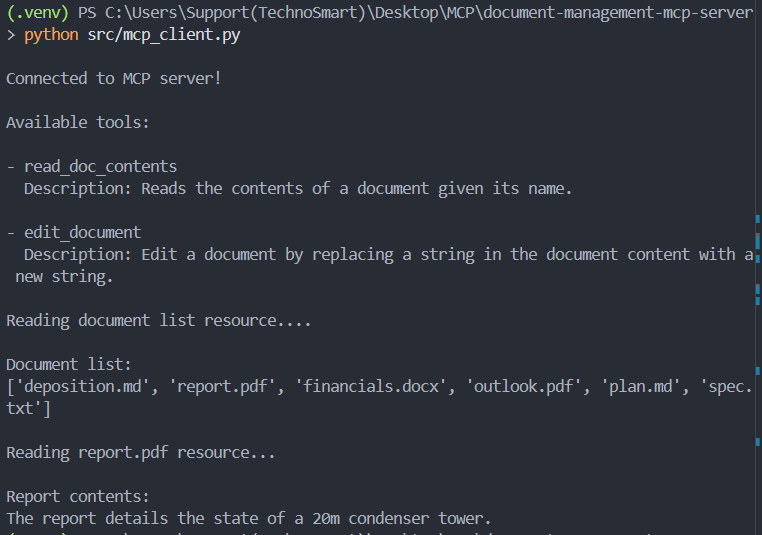
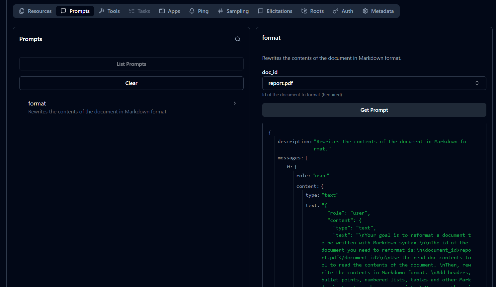
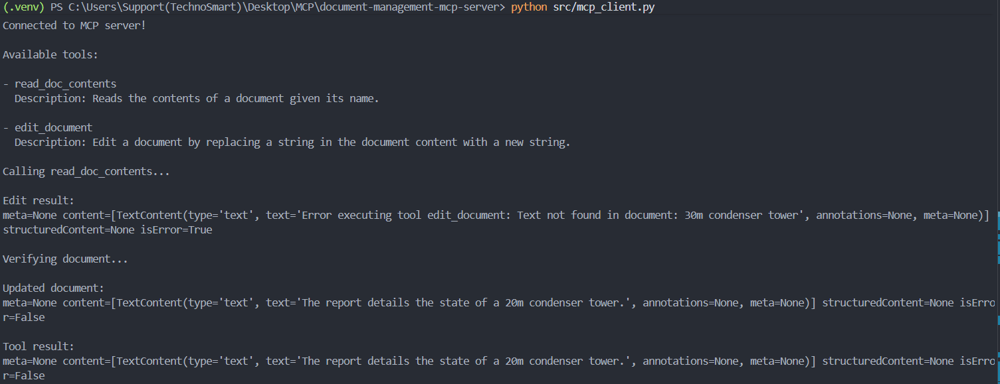

# Document Management MCP Server

A simple document management server built with the official **Model Context Protocol (MCP) Python SDK**.

This project is being developed alongside the **Claude Academy — Introduction to Model Context Protocol** course to understand how MCP servers, tools, clients, and the MCP Inspector work together.

---

## 📚 Learning Project

This repository follows the concepts taught in:

**Claude Academy — Introduction to Model Context Protocol**

The goal is not just to complete the course, but to implement each concept in a working MCP project and maintain it as a practical reference.

---

## 🏗️ Project Overview

This project implements an MCP server that provides tools for reading and editing documents.

Currently, documents are stored in memory using a Python dictionary.

### Current Architecture

```text
┌─────────────────────┐
│    MCP Client       │
│                     │
│  MCP Inspector      │
└──────────┬──────────┘
           │
           │ MCP / STDIO
           ▼
┌─────────────────────┐
│   DocumentMCP       │
│                     │
│   Python Server     │
└──────────┬──────────┘
           │
           ▼
┌─────────────────────┐
│ In-Memory Documents │
│                     │
│ Python Dictionary   │
└─────────────────────┘


## MCP Inspector 






## MCP Client 



