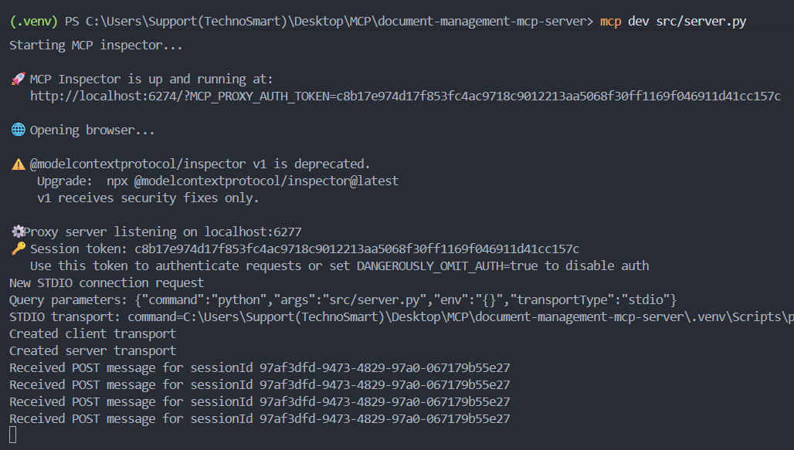
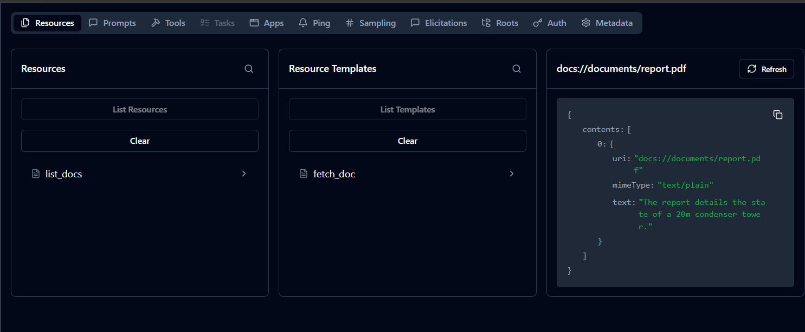
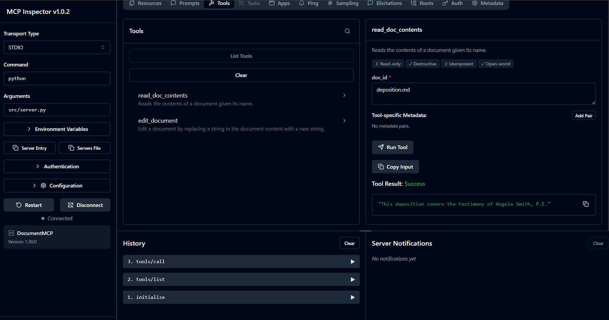
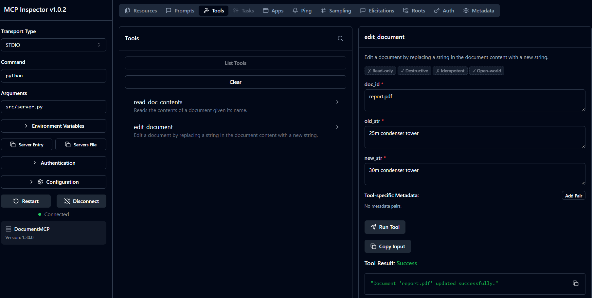
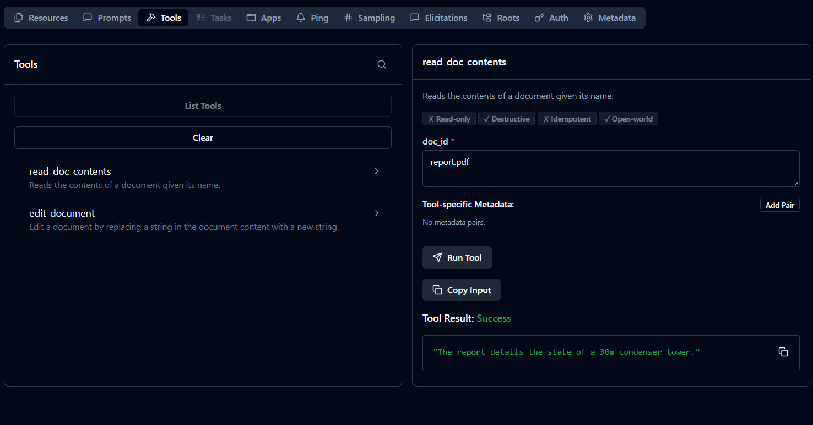
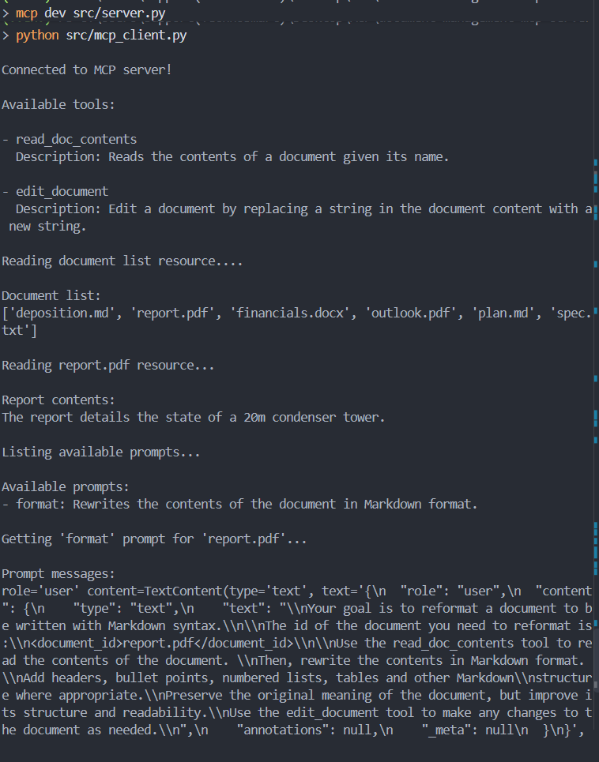
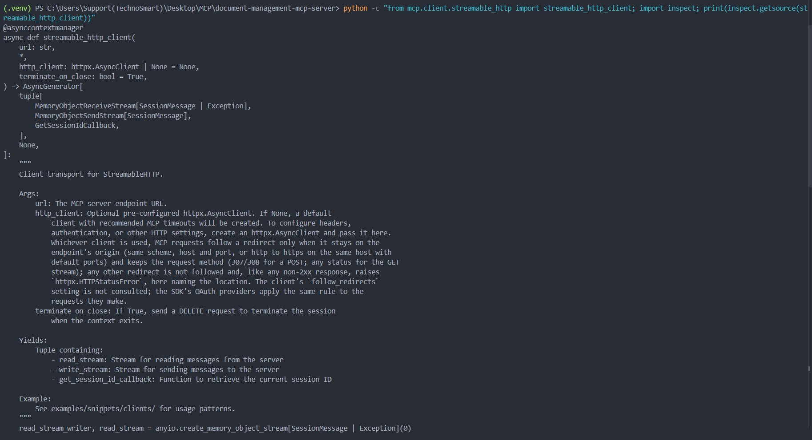
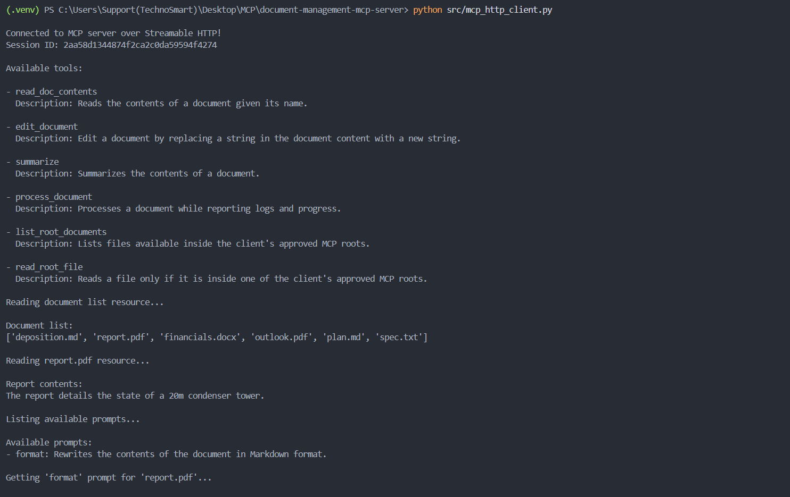
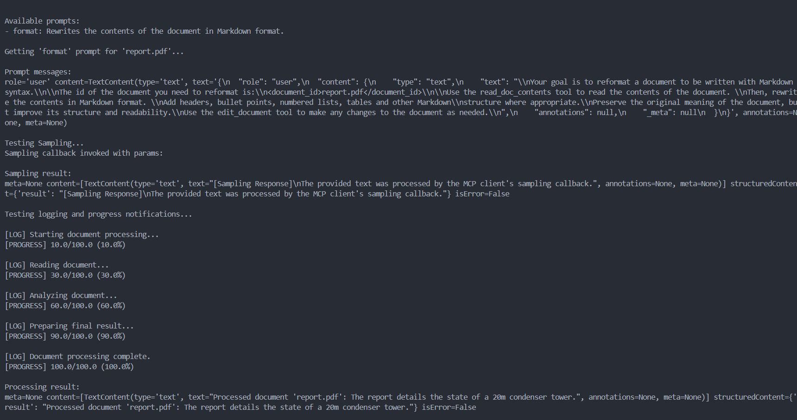
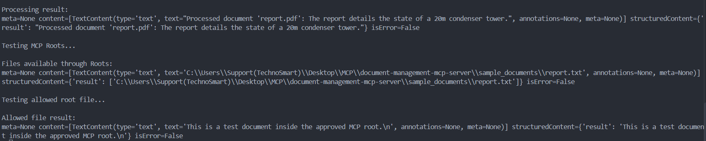

# Document Management MCP Server

A simple document management server built with the official **Model Context Protocol (MCP) Python SDK**.

This project is being developed alongside the **Claude Academy — Introduction to Model Context Protocol** course to understand how MCP servers, tools, clients, and the MCP Inspector work together.

---

## 📚 Learning Project

This repository follows the concepts taught in:

**Claude Academy — Introduction to Model Context Protocol**

The goal is not just to complete the course, but to implement each concept in a working MCP project and maintain it as a practical reference.

---

## 🏗️ Project Overview

This project implements an MCP server that provides tools for reading and editing documents.

Currently, documents are stored in memory using a Python dictionary.

### Current Architecture

```text
┌─────────────────────┐
│    MCP Client       │
│                     │
│  MCP Inspector      │
└──────────┬──────────┘
           │
           │ MCP / STDIO
           ▼
┌─────────────────────┐
│   DocumentMCP       │
│                     │
│   Python Server     │
└──────────┬──────────┘
           │
           ▼
┌─────────────────────┐
│ In-Memory Documents │
│                     │
│ Python Dictionary   │
└─────────────────────┘
```




## MCP Inspector




### Inspector snapshots







## MCP Client 


## Defining Resources


## Accessing Resources


## Prompts

### Server side Prompt 


### Client side Prompt



## Sampling 

                 MCP
┌──────────────┐       ┌──────────────┐
│ MCP Server   │       │ MCP Client   │
│              │       │              │
│ summarize()  │       │              │
│      │       │       │              │
│      │ create_message()            │
│      ├────────────────────────────►│
│              │       │ sampling    │
│              │       │ callback    │
│              │       │      │       │
│              │       │      ▼       │
│              │       │   Claude    │
│              │       │      │       │
│              │       │      ▼       │
│              │◄─────────────────────┤
│      │       │       │              │
│      ▼       │       │              │
│  summary     │       │              │
└──────────────┘       └──────────────┘


## Log and Notification 


## Roots 


## Complete Model of the following features

TOOLS
Server → Client
"Here's functionality you can call."


RESOURCES
Server → Client
"Here's data you can read."


PROMPTS
Server → Client
"Here's a reusable prompt."


SAMPLING
Server → Client → LLM → Client → Server
"Ask the client's LLM to generate something."


LOGGING / PROGRESS
Server → Client
"Here's what's happening while I'm working."


ROOTS
Client → Server
"These filesystem locations are in scope."


## Json Message types

                 MCP Connection
              ┌──────────────────┐
              │                  │
Client  ◄─────┤   Bidirectional  ├─────► Server
              │                  │
              └──────────────────┘


Client → Server

initialize
tools/list
tools/call
resources/read

Server
  │
  │ CreateMessage Request
  ↓
Client
  │
  │ Sampling Result
  ↓
Server

             ┌─────────────────────┐
             │    MCP Connection   │
             └─────────────────────┘

Client ───────────────► Server
       tools/call

Client ◄────────────── Server
       sampling

Client ◄────────────── Server
       roots

Client ◄────────────── Server
       logging

Client ◄────────────── Server
       progress


## STDIO

STDIO is a transport that communicates between the MCP client and server using the server process's standard input and standard output.

## StreamableHTTP in depth


Streamable HTTP combines HTTP request/response with streaming so MCP can preserve its bidirectional communication model as much as HTTP allows.




## Current Architecture

                    MCP Protocol
                         │
              ┌──────────┴──────────┐
              │                     │
            STDIO          Streamable HTTP
              │                     │
              ▼                     ▼
       stdin/stdout             HTTP / SSE
              │                     │
              ▼                     ▼
       MCP Server             MCP Server







## Completion of MCP

https://academy.claude.com/verify/7d506466ceb76c932380746d7d2f3fbc

https://academy.claude.com/verify/bcfdd0026bf9305bc508928be1b54c4e